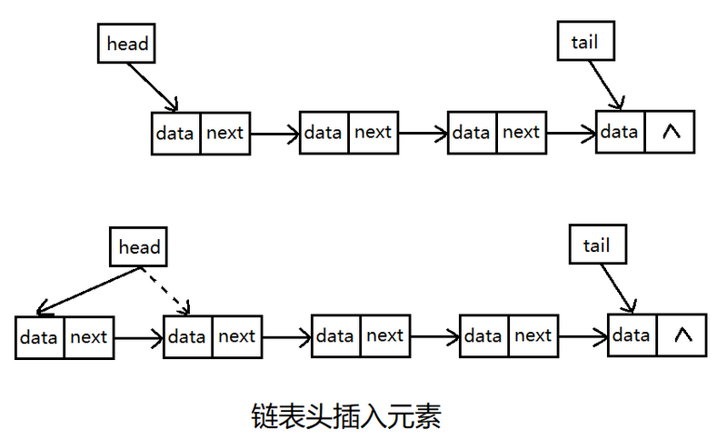
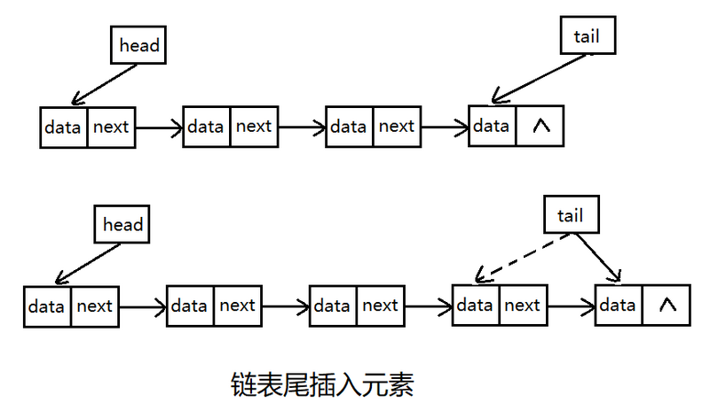
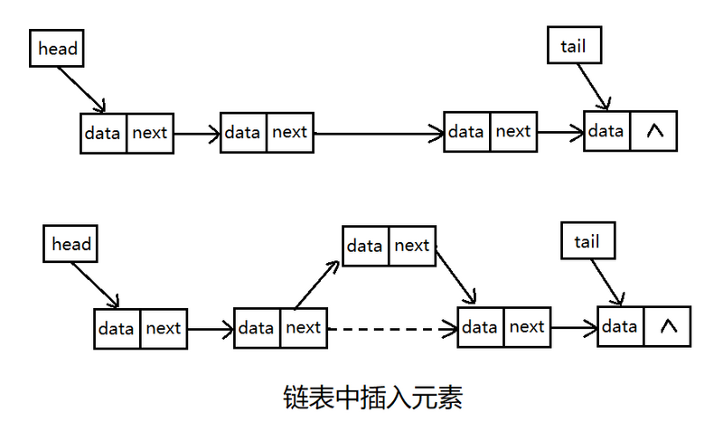
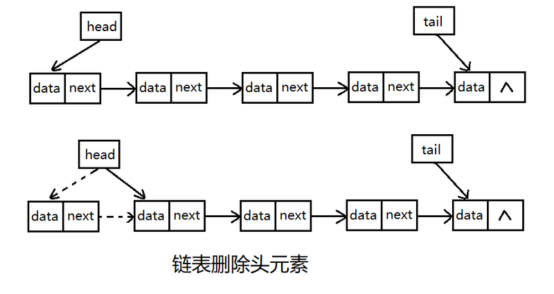
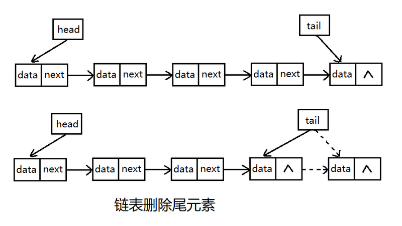
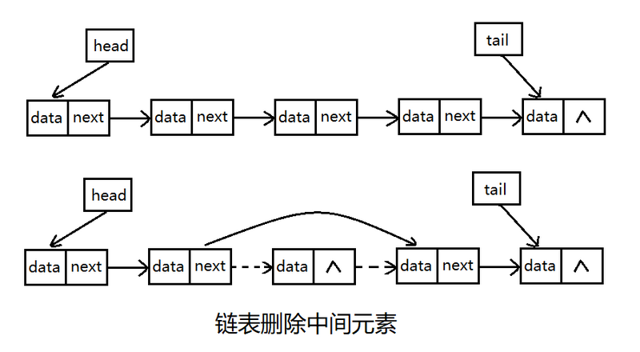

# 链表概念介绍

#### 一、链表的概念和特点

1. 链表是由若干结点组成，每个结点至少包括两部分信息：一个是元素数据，一个是指向下一个（上一个）元素地址的指针。链表的存储在物理上是非连续、非顺序的存储结构，数据元素之间是通过每个元素的指针来关联的。

2. 与数组相比，链表独特的存储结构克服了数组提前需要设置长度的缺点，在运行时可以动态的快速的添加和删除元素；计算机的存储空间并非连续的，而链表则可以灵活的使用存储空间，能更好的对计算机内存进行动态管理。

3. 链表分为单链表、双链表、和循环链表，双链表的每个结点有两个指针，分别指向前一个元素和后一个元素，循环链表的尾结点指针不是null，而是指向头结点元素的地址。

#### 二、链表的操作

1. 链表的操作包括了创建、删除、插入、输出。

2. 创建就是空间的分配，将头、尾指针及链表结点个数等初始化。

3. 删除和插入根据被操作元素的位置可以细分为头删除（插入），尾删除（插入），中间删除（插入），以下详细介绍。

#### 三、插入操作

插入分为头插入，尾插入，中间插入

##### 头插入

头插入实际上是增加一个新节点，然后把新增加的结点指针指向原来头指针指向的元素，再把头指针指向新增的节点。

##### 尾插入

尾插入也是增加一个新节点，该节点指针置为null，然后把原尾结点指针指向新增加的节点，最后把尾指针指向新增加的节点即可。

##### 中间插入

中间插入稍复杂，首先增加一个节点，然后新增节点的指针指向插入位置的后一个节点，把插入位置的前一个节点指针指向新插入节点即可。

#### 四、删除操作

删除与插入类似，根据被操作元素的位置分为头删除，尾删除，中间删除

##### 头删除

删除头元素时，先将头指针指向下一个节点，然后把原头结点的指针置空即可

##### 尾删除

删除尾元素时，首先找到链表倒数第2个元素，然后把尾指针指向这个元素，接着把原倒数第2个元素的指针置空。

##### 中间删除

删除中间元素相对复杂一些，首先将要删除的节点的前一个节点指针指向要删除的节点的下一个节点，然后把要删除节点的指针置空。
